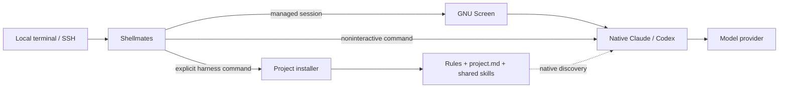

# Shellmates

**Keep your coding agents running. Bring the same working habits to every project.**

Shellmates gives Claude Code and Codex persistent, topic-named terminal sessions.
Start work locally or over SSH, detach, and reconnect to the same running agent.
Its optional project harness gives both agents shared instructions, handovers and
explicit cross-review, without installing global agent configuration.

Small tools, clear boundaries: GNU Screen keeps the terminal alive; native CLIs
own authentication, permissions and conversations; the harness owns project context.

[Get started](#build-from-source) · [Project harness](docs/HARNESS.md) ·
[Usage](docs/USAGE.md) · [Architecture](docs/ARCHITECTURE.md) ·
[Installation](docs/INSTALLATION.md) · [Security](SECURITY.md)

## What you get

- **Persistent sessions:** topics, session listing, detach, attach, and explicit takeover.
- **Native Claude and Codex:** original arguments and vendor settings, with no flag translation.
- **A project-local harness:** install, check, update and remove shared rules and skills.
- **One useful skill set:** handover and permission-bounded Claude ↔ Codex review.
- **Conservative lifecycle handling:** uncertain shutdown stays visible; it is not silently pruned.
- **Portable deployment:** macOS and Linux, amd64 and arm64; no separate harness checkout required.

No background agent fleet, recursive reviewer loop, Beads requirement, or mandatory proxy.

## Build from source

There are no published release assets yet. For now, build from this repository.
Use the Go **1.26.8** toolchain pinned in CI. Harness commands also require
**Python 3.9+** and Git; managed sessions require **GNU Screen** and your chosen
native Claude/Codex CLI. Install and authenticate vendor CLIs separately.

```sh
git clone https://github.com/ctrl-alt-raccoon/shellmates.git
cd shellmates
export GOTOOLCHAIN=go1.26.8
go build -o sclaude ./cmd/sclaude

# Enable both native backends; no proxy and no shell-profile edits.
./sclaude setup --backends claude,codex --no-modify-path

# Create a named session in your current working directory.
./sclaude new --backend codex --topic "First session"
```

Choose `--backends claude` or `--backends codex` if you only use one.
Setup can install a missing Screen package on macOS; Linux privileged package
installation requires explicit consent. See [setup boundaries](docs/INSTALLATION.md#what-setup-checks)
before provisioning a shared machine. Harness installation itself installs no packages.

Detach with **Ctrl-a, then d**. After reconnecting over SSH:

```sh
/path/to/sclaude list
/path/to/sclaude attach SESSION_ID
# When the work is finished:
/path/to/sclaude stop SESSION_ID
```

Shellmates must run on the machine that hosts the agent process. Reconnecting means
SSH into that same machine and attach there; it does not move a live process between hosts.

## Install the harness in a project

From the repository you want to use, with your built or installed executable:

```sh
/path/to/sclaude harness install --project . --dry-run
/path/to/sclaude harness install --project .
/path/to/sclaude harness check --project .
```

That project now has shared working agreements, a `project.md` instruction source,
native Claude/Codex entries and both shared skills. Fill in the project's real
commands and constraints, then regenerate:

```sh
/path/to/sclaude harness update --project .
```

Start a fresh Claude or Codex session in that project, through Shellmates or directly.
No Screen setup or vendor login is needed merely to install the harness.

The default installation is **project-owned and shareable through Git**. Review
its files before committing them. For a private, checkout-only installation:

```sh
/path/to/sclaude harness install --project . --local
# Optionally import your own personal rules, explicitly:
/path/to/sclaude harness install --project . --local --preferences /private/path/house-rules.md
```

Local mode uses repository-local Git exclusions, never global ignore settings.
It refuses already-tracked native/harness destinations: ignoring a tracked file
does not make it private. Personal preferences are never imported automatically.

[Installation details, updates, safe removal and migration](docs/HARNESS.md)

## Architecture

Two paths share one entry point, not one giant agent runtime:



The harness is configuration and explicit workflows, **not a replacement for the
vendor CLI or a security sandbox**. Existing global instructions can still apply.
Native credentials are neither copied nor rewritten.

See [the architecture guide](docs/ARCHITECTURE.md) for instruction ownership,
shutdown flow, source paths, and an optional **Archify interactive map**.
Archify is pinned, opt-in documentation tooling; it is not a runtime dependency
and is never installed globally by Shellmates.

## Three launchers, distinct meanings

| Command | What runs | Configuration owner |
|---|---|---|
| `sclaude` | Native Claude Code | Claude |
| `scodex` | Native Codex CLI | Codex |
| `sclaudex` | Claude through the optional CLIProxyAPI route, or an existing opaque `claudex` | Explicit proxy/external setup |

The project is called **Shellmates**, but these command names remain compatibility
contracts. There is no separate `shellmates` executable. Source builds produce
`sclaude`; the release installer creates all three launcher links. Neither replaces
`claude`, `codex`, or an existing `claudex`.

Codex `-p` means **profile**; Claude `-p` means **print**. Put vendor arguments after
`new`'s `--`, and they are forwarded unchanged. Use `sclaude harness` for harness
management; `scodex update` still belongs to Codex. Codex's own status line remains
untouched. [Argument and dispatch details](docs/INSTALLATION.md#native-codex-arguments-and-command-names)

The optional `sclaudex` route is **Claude Code using another model provider**, not
Codex CLI running Claude. Authentication precedence can affect routing; read the
[proxy guide](docs/PROXY.md) before relying on it.

## Reliability and limits

Shellmates stores session metadata, not conversations. Topics and working-directory
paths are persistent metadata: do not put secrets in them. Launch arguments use
private, one-use files and are not retained in session records.

A stop is complete only after the owning runner acknowledges backend exit and
Screen disappearance is confirmed. An unconfirmed stop remains pending. Custom
wrappers must forward signals and wait, or `exec` their backend. A disconnected
terminal is not a stopped process. [Lifecycle and privacy](docs/USAGE.md#state-and-privacy)

Tests cover disposable state, install/update/removal, native argument boundaries,
Screen lifecycle and localhost CLI fixtures. Synthetic-provider tests prove
configuration delivery and tool exposure—not guaranteed model obedience. See
[STATUS.md](STATUS.md) for exact results and the remaining real Linux/SSH pilot scope.

## Contributing and security

Read [CONTRIBUTING.md](CONTRIBUTING.md) and [project.md](project.md). Keep changes
small, preserve native provider boundaries, and test against disposable profiles.
Report vulnerabilities privately as described in [SECURITY.md](SECURITY.md).

[MIT license](LICENSE). Independent community software, not affiliated with
Anthropic, OpenAI, GNU, CLIProxyAPI, or Archify. Account owners are responsible for
provider terms when choosing third-party routing.
