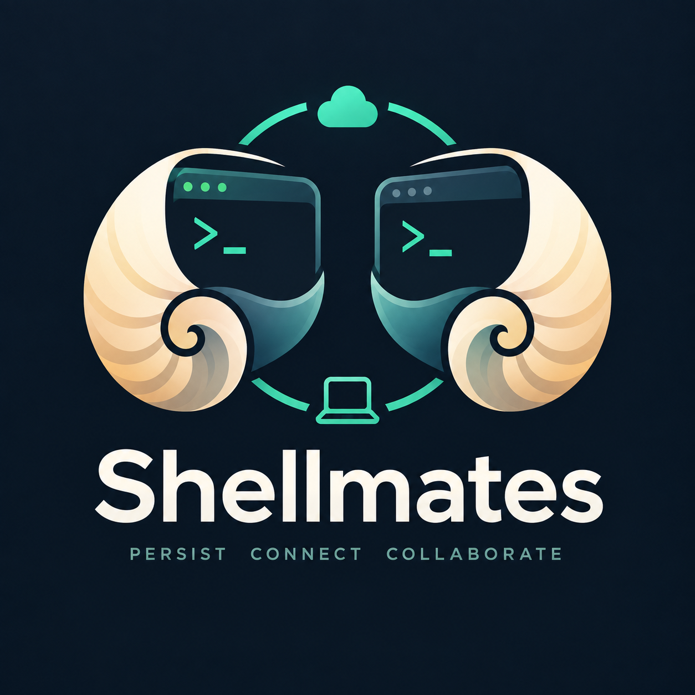
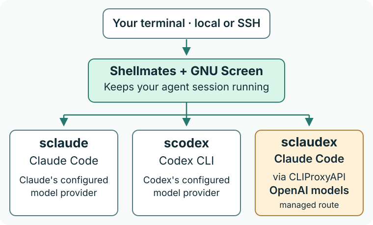

<p align="center">
  
</p>

# Shellmates

**Keep your coding agents running. Bring the same working habits to every project.**

Shellmates gives Claude Code and Codex persistent, topic-named terminal sessions.
Start work locally or over SSH, detach, and reconnect to the same running agent.
Its optional project harness gives both agents shared instructions, handovers and
explicit cross-review, without installing global agent configuration.

Use Claude Code, native Codex, or **Claude Code powered by OpenAI models**.
Shellmates keeps the session running and the project instructions consistent;
you choose the coding agent and model route.

[Get started](#build-from-source) · [Project harness](docs/HARNESS.md) ·
[Usage](docs/USAGE.md) · [Architecture](docs/ARCHITECTURE.md) ·
[Installation](docs/INSTALLATION.md) · [Security](SECURITY.md)

## What you get

- **Leave and come back to the same work.** Detach before closing your terminal,
  or reconnect after an ordinary SSH disconnect. Your agent stays on the host;
  a named session gets you back to it without starting another conversation.
- **Choose the workflow as well as the model.** Keep native Claude or Codex, or
  use Claude Code's workflow with OpenAI models through the optional proxy route.
- **Stop re-explaining each repository.** Install shared working agreements,
  `project.md`, handover and cross-review once per project. Claude and Codex get
  the same maintained sources; you do not need matching global configurations.
- **Get a second opinion deliberately.** Ask Claude to review Codex's work, or
  the reverse, through one explicit permission-bounded review. No agent fleet.
- **Keep setup portable and reversible.** The harness travels with the project,
  has install/check/update/remove commands, and needs no separate harness checkout.
  Shellmates supports macOS/Linux on amd64/arm64.

No background agent fleet, recursive reviewer loop, Beads requirement, or mandatory proxy.

## Pick your launcher

| Command | Agent workflow and tools | Model route | Choose it when… |
|---|---|---|---|
| `sclaude` | Claude Code | Claude's configured provider | You want the native Claude experience. |
| `scodex` | Codex CLI | Codex's configured provider | You want native Codex, including its own settings and permissions. |
| `sclaudex` (managed) | **Claude Code** | **CLIProxyAPI → OpenAI/Codex models** | You want OpenAI models inside the Claude Code workflow you already use. |

**`sclaudex` is Claude Code as the agent harness, with OpenAI models behind it.
It is not the Codex CLI.** This lets you keep supported Claude commands, tools,
skills and project conventions while changing the model route. It does not give
you Codex CLI's native features, guarantee complete feature parity, or promise
lower cost or better results. It adds a proxy and its authentication/setup needs.

If setup adopts an existing external `claudex`, Shellmates runs that executable
unchanged; the managed-route description does not define its behavior.
An existing Claude gateway sign-in can also override proxy routing. Read the
[proxy guide and routing check](docs/PROXY.md#sclaudex-direction) before using it.

The **Shellmates project harness** is a different, optional layer: shared files and
skills for your repositories. It works with native Claude, native Codex and managed
`sclaudex`, including Claude or Codex started directly. It does not replace either
vendor's agent runtime.

## Build from source

There are no published release assets yet. For now, build from this repository.

### 1. Install prerequisites

Run these commands on the machine that will host your agents—on the Linux server
if you will connect over SSH. You need **Go and Git to build**, **GNU Screen for
persistent sessions**, and **Python 3.9+ for the optional project harness**. The
commands also include `curl` for downloading installers; no Python packages are needed.

**macOS — with [Homebrew](https://docs.brew.sh/Installation) installed:**

```sh
brew install go git screen python curl
```

If `brew` is not found, install Homebrew first and follow its printed `PATH`
instructions before running that command.

**Linux — [Ubuntu 24.04+](https://packages.ubuntu.com/noble/golang-go) or
[Debian 13+](https://packages.debian.org/trixie/golang-go), with administrator access:**

```sh
sudo apt-get update && sudo apt-get install -y golang-go git screen python3 curl ca-certificates
```

These distributions provide a Go command new enough to download the pinned
toolchain. On older Ubuntu/Debian releases or other distributions, install the
equivalent packages and use the [official Go installer](https://go.dev/doc/install)
if your packaged Go is older than **1.21**. That is the minimum for
[toolchain switching](https://go.dev/doc/toolchain), not Shellmates' build version:
the build command below selects **Go 1.26.8**, matching CI, and downloads it if
needed. Allow internet access for the first build.

Check that the commands are on your `PATH`:

```sh
go version && git --version && screen --version && python3 --version && curl --version
```

### 2. Install and sign in to your coding agent

The package commands above **do not install Claude Code or Codex**. Install at
least one using the official [Claude Code setup guide](https://code.claude.com/docs/en/setup)
or [Codex CLI setup guide](https://learn.chatgpt.com/docs/codex/cli), then run
`claude` or `codex` directly and complete its sign-in. If your chosen CLI already
works, skip this step. You do not need both agents.

The vendors' native installers do not require Node.js/npm. **CLIProxyAPI is
optional**, needed only for the managed `sclaudex` route; the native quickstart
below does not use it. See [proxy setup](docs/PROXY.md) if you want that route.

### 3. Build and start a session

This example uses native Codex:

```sh
git clone https://github.com/ctrl-alt-raccoon/shellmates.git
cd shellmates
GOTOOLCHAIN=go1.26.8 go build -o sclaude ./cmd/sclaude

# Enable native Codex; no proxy and no shell-profile edits.
./sclaude setup --backends codex --no-modify-path

# Create a named session in your current working directory.
./sclaude new --backend codex --topic "First session"
```

For Claude instead, use `--backends claude` during setup and `--backend claude`
when creating the session. To enable both installed agents, set up with
`--backends claude,codex` and choose either backend when creating a session.
Setup can install a missing Screen package on macOS; Linux privileged package
installation requires explicit consent. See [setup boundaries](docs/INSTALLATION.md#what-setup-checks)
before provisioning a shared machine. Harness installation itself installs no packages.

Detach with **Ctrl-a, then d**. After reconnecting over SSH:

```sh
/path/to/sclaude list
/path/to/sclaude attach SESSION_ID
# When the work is finished:
/path/to/sclaude stop SESSION_ID
```

Shellmates must run on the machine that hosts the agent process. Reconnecting means
SSH into that same machine and attach there; it does not move a live process between hosts.

## Install the harness in a project

From the repository you want to use, with your built or installed executable:

```sh
/path/to/sclaude harness install --project . --dry-run
/path/to/sclaude harness install --project .
/path/to/sclaude harness check --project .
```

That project now has shared working agreements, a `project.md` instruction source,
native Claude/Codex entries and both shared skills. Fill in the project's real
commands and constraints, then regenerate:

```sh
/path/to/sclaude harness update --project .
```

Start a fresh Claude or Codex session in that project, through Shellmates or directly.
No Screen setup or vendor login is needed merely to install the harness.

The default installation is **project-owned and shareable through Git**. Review
its files before committing them. For a private, checkout-only installation:

```sh
/path/to/sclaude harness install --project . --local
# Optionally import your own personal rules, explicitly:
/path/to/sclaude harness install --project . --local --preferences /private/path/house-rules.md
```

Local mode uses repository-local Git exclusions, never global ignore settings.
It refuses already-tracked native/harness destinations: ignoring a tracked file
does not make it private. Personal preferences are never imported automatically.

[Installation details, updates, safe removal and migration](docs/HARNESS.md)

## Architecture

One persistent terminal layer, three explicit ways to run your coding agent:



This is the managed interactive-session path. Noninteractive commands run directly,
without Screen. The native agents own their tools, permissions and conversations.
The optional project harness supplies instructions and skills; it is **not a
security sandbox**, and existing global instructions can still apply.

See [the architecture guide](docs/ARCHITECTURE.md) for the small instruction-flow
diagram, shutdown steps and source paths. The detailed Archify map is optional
developer reference, not something you need to open or zoom into to get started.

## Command names and arguments

The project is called **Shellmates**, but these command names remain compatibility
contracts. There is no separate `shellmates` executable. Source builds produce
`sclaude`; the release installer creates all three launcher links. Neither replaces
`claude`, `codex`, or an existing `claudex`.

Codex `-p` means **profile**; Claude `-p` means **print**. Put vendor arguments after
`new`'s `--`, and they are forwarded unchanged. Use `sclaude harness` for harness
management; `scodex update` still belongs to Codex. Codex's own status line remains
untouched. [Argument and dispatch details](docs/INSTALLATION.md#native-codex-arguments-and-command-names)

## Reliability and limits

Shellmates stores session metadata, not conversations. Topics and working-directory
paths are persistent metadata: do not put secrets in them. Launch arguments use
private, one-use files and are not retained in session records.

A stop is complete only after the owning runner acknowledges backend exit and
Screen disappearance is confirmed. An unconfirmed stop remains pending. Custom
wrappers must forward signals and wait, or `exec` their backend. A disconnected
terminal is not a stopped process. [Lifecycle and privacy](docs/USAGE.md#state-and-privacy)

Tests cover disposable state, install/update/removal, native argument boundaries,
Screen lifecycle and localhost CLI fixtures. Synthetic-provider tests prove
configuration delivery and tool exposure—not guaranteed model obedience. See
[STATUS.md](STATUS.md) for exact results and the remaining real Linux/SSH pilot scope.

## Contributing and security

Read [CONTRIBUTING.md](CONTRIBUTING.md) and [project.md](project.md). Keep changes
small, preserve native provider boundaries, and test against disposable profiles.
Report vulnerabilities privately as described in [SECURITY.md](SECURITY.md).

[MIT license](LICENSE). Independent community software, not affiliated with
Anthropic, OpenAI, GNU, CLIProxyAPI, or Archify. Account owners are responsible for
provider terms when choosing third-party routing.
