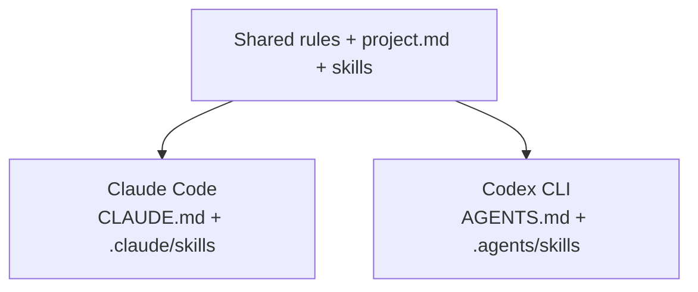

# Shellmates architecture

[Overview](../README.md) · [Harness](HARNESS.md) · [Runtime behavior](USAGE.md)

Shellmates keeps an agent's terminal session running. Its optional project harness
gives agents a shared set of working instructions and skills. These are separate
responsibilities, not a new agent runtime.

## The runtime, at a glance


Read this from top to bottom: your terminal attaches to a persistent session;
that session contains the chosen agent. Detaching disconnects your terminal, not
the agent. Noninteractive commands skip Screen entirely.

Managed **`sclaudex` keeps Claude Code as the agent harness**: Claude commands,
tools, permissions and supported skills. CLIProxyAPI connects that harness to
OpenAI/Codex models. **`scodex` runs the actual Codex CLI instead.** An adopted
external `claudex` is opaque; its routing is not defined by this picture.

This distinction is useful when you prefer Claude's workflow but want an OpenAI
model. It also means accepting an extra proxy, model mapping and authentication
boundary. It is not native Codex feature parity or a routing guarantee. The
[proxy guide](PROXY.md) covers those limits and the gateway-authentication caveat.

## One instruction model, two native destinations



The installer delivers these shared sources through thin native adapters.
Claude Code discovers its side for both `sclaude` and managed `sclaudex`; native
Codex discovers the other side for `scodex`. Neither needs a global harness install.

Generated blocks are delivery artifacts, not editable handbooks. Existing native
text is preserved outside those blocks until it can be deliberately consolidated.
Shared project installations can travel through Git; private checkout installations
exclude their generated files locally. Relative skill links never point back to
a developer's source checkout.

Instruction ownership:

- Always-working preferences: shared defaults, or an explicitly supplied personal file.
- How this repository works: `project.md` (legacy project/style files remain compatible).
- A provider-specific compatibility requirement: the adapter or preserved native notes.
- A reusable procedure requested on demand: a shared skill.
- Security guarantees: permissions and structural checks, not repeated prose.

Actual precedence is native-provider behavior; this is an ownership convention,
not a replacement instruction hierarchy. Global, managed and narrower directory
instructions can still apply. No startup/compaction reinjection is added.

## Stopping a session

1. Persist the user's stop request.
2. The owning runner terminates and waits for its child, then records backend exit.
3. Confirm that the Screen session has disappeared, closing it if necessary.
4. Finalize the stopped record. Report success only if durable finalization succeeds.

A missing acknowledgement or uncertain Screen state leaves the stop pending.
The manager never signals a PID recovered from metadata. Screen detach and
ordinary SSH disconnection are not stop requests. See [runtime limits](USAGE.md#state-and-privacy)
for uncatchable crashes, legacy runners and opaque wrapper requirements.

## Source ownership

| Component | Responsibility |
|---|---|
| `cmd/sclaude`, `internal/app` | Dispatch and literal argument boundaries |
| `internal/session`, `internal/screen` | Named sessions, reconnect and supervised stop |
| `internal/backend` | Native executable selection and the optional managed proxy route |
| `internal/setup` | Explicit machine setup and installation lifecycle |
| `internal/harness` | Embedded project installer and shared skill sources |
| Native Claude/Codex | Agent tools, authentication, permissions and conversations |

The Go harness adapter extracts its embedded sources to a private temporary
directory, invokes Python with an argument array, then removes that extraction.
Python 3.9+ standard-library code owns the project-file lifecycle and is included
in the installed snapshot. Harness commands need neither Screen nor a configured
agent backend. They do not bootstrap a package manager or run an external checkout.

## Optional detailed Archify map

The compact SVG above is the primary overview and renders directly on GitHub.
Edit [its source](architecture/overview.svg) when the three launcher routes change.
It has no renderer dependency. The detailed component map below is a separate
implementation view for maintainers, not the onboarding diagram.

[Archify](https://github.com/tt-a1i/archify) turns an authored, typed JSON map into
a self-contained interactive HTML/SVG document. It is useful for exploring this
architecture, but its renderer is not needed to install or run Shellmates.

We keep only our [map specification](architecture/shellmates.architecture.json)
and a small [rendering helper](../scripts/render-architecture.sh). The short
instruction diagram above also renders directly on GitHub. We do not vendor
Archify, globally install its skill, start a watcher, or fetch updates at runtime.

To render the optional interactive map, inspect a clean checkout at the pinned
upstream revision. This runs third-party code with your user privileges; a pinned
commit is reproducible input, not an independent security certification.

```sh
git clone https://github.com/tt-a1i/archify.git /path/to/archify
git -C /path/to/archify checkout --detach c6519401f7b91b9d43011657880893b0a8955548
# Inspect that checkout before running it. Node 18+ must already be installed.
sh scripts/render-architecture.sh /path/to/archify /new/path/shellmates.html
```

The helper refuses a different/dirty revision or an existing output. It disables
Archify's optional update check, validates the specification and delivers a new
HTML file. It never installs Node, npm packages or a provider skill. Do not commit
generated HTML, browser profiles, screenshots or renderer dependencies into the
application. The small source specification is the maintained artifact.

For an installed Chrome/Chromium, optional bounded browser evidence is separate:

```sh
ARCHIFY_UPDATE_CHECK_DISABLED=1 node /path/to/archify/archify/bin/archify.mjs \
  visual-check /new/path/shellmates.html --json
```

Artifact validation, real-browser measurements and human visual inspection are
different evidence. See [STATUS.md](../STATUS.md) for what was actually checked;
do not infer a visual review from a successful JSON receipt. The map is an authored
overview grounded in the source paths above, not live infrastructure discovery or
a runtime dependency scanner. Update it when these ownership boundaries change.
