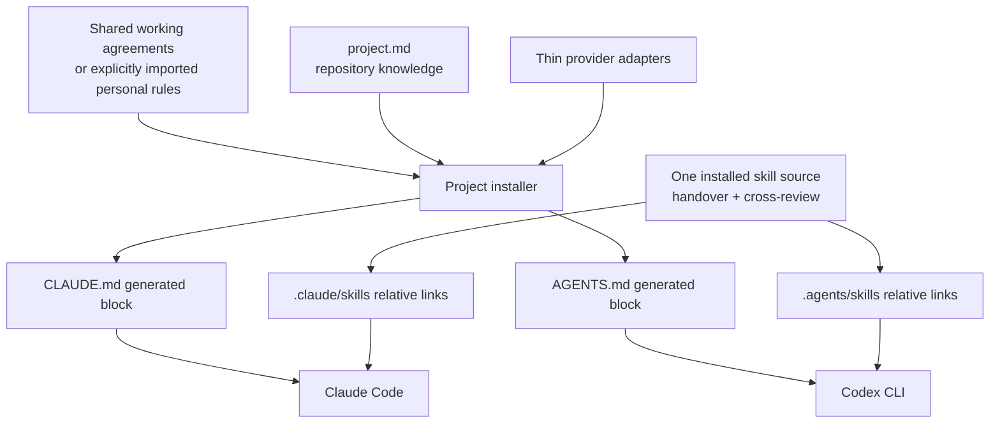

# Shellmates architecture

[Overview](../README.md) · [Harness](HARNESS.md) · [Runtime behavior](USAGE.md)

Shellmates has two deliberately separate responsibilities: manage a terminal
session, and install an optional project-local working model for coding agents.
Neither responsibility replaces the native agent or owns its credentials.

## Runtime boundaries

| Component | Owns | Does not own |
|---|---|---|
| `cmd/sclaude`, `internal/app` | Command dispatch, literal argument boundaries | Translating Claude flags into Codex flags |
| `internal/session`, `internal/screen` | Named Screen sessions, reconnect, supervised stop | Vendor conversations or arbitrary daemonized processes |
| `internal/backend` | Native executable and optional managed proxy boundary | Native authentication or permission policy |
| `internal/setup` | Explicit machine installation/setup/update | Implicit privileged package installs or project policy |
| `internal/harness` | Embedded project installer and shared skill sources | Global profiles, reinjection hooks, agent orchestration |
| Native Claude/Codex | Models, auth, sandbox/approvals, conversation history | Shellmates session records |

The Go harness adapter extracts trusted embedded sources to a private temporary
directory, invokes Python with an argument array, and removes that extraction.
Python 3.9+ standard-library code owns the project-file lifecycle and is also
included in the installed snapshot. There is no package-manager bootstrap,
external-source execution, or dependency on Screen for harness commands.

## One instruction model, two native destinations



Generated blocks are delivery artifacts, not editable handbooks. Existing native
text is preserved outside those blocks until it can be deliberately consolidated.
Shared project installations can travel through Git; private checkout installations
exclude their generated files locally. Relative skill links never point back to
a developer's source checkout.

Instruction ownership:

- Always-working preferences: shared defaults, or an explicitly supplied personal file.
- How this repository works: `project.md` (legacy project/style files remain compatible).
- A provider-specific compatibility requirement: the adapter or preserved native notes.
- A reusable procedure requested on demand: a shared skill.
- Security guarantees: permissions and structural checks, not repeated prose.

Actual precedence is native-provider behavior; this is an ownership convention,
not a replacement instruction hierarchy. Global, managed and narrower directory
instructions can still apply. No startup/compaction reinjection is added.

## Stop is a protocol, not just closing Screen

```mermaid
sequenceDiagram
    participant U as Terminal / SSH
    participant M as Session manager
    participant D as Private session store
    participant R as Owning runner
    participant B as Backend process
    participant S as GNU Screen
    U->>M: stop SESSION
    M->>D: Persist stop request
    R->>D: Observe request
    R->>B: SIGTERM; bounded SIGKILL escalation
    B-->>R: Child exit / wait completes
    R->>D: Acknowledge backend exit
    M->>S: Close session after acknowledgement
    S-->>M: Socket absence confirmed
    M->>D: Finalize stopped record
```

A missing acknowledgement or uncertain Screen state leaves the stop pending.
The manager never signals a PID recovered from metadata. Screen detach and
ordinary SSH disconnection are not stop requests. See [runtime limits](USAGE.md#state-and-privacy)
for uncatchable crashes, legacy runners and opaque wrapper requirements.

## Optional Archify integration

[Archify](https://github.com/tt-a1i/archify) turns an authored, typed JSON map into
a self-contained interactive HTML/SVG document. It is useful for exploring this
architecture, but its renderer is not needed to install or run Shellmates.

We keep only our [map specification](architecture/shellmates.architecture.json)
and a small [rendering helper](../scripts/render-architecture.sh). The Mermaid
graphs above and in the README render directly on GitHub. We do not vendor
Archify, globally install its skill, start a watcher, or fetch updates at runtime.

To render the optional interactive map, inspect a clean checkout at the pinned
upstream revision. This runs third-party code with your user privileges; a pinned
commit is reproducible input, not an independent security certification.

```sh
git clone https://github.com/tt-a1i/archify.git /path/to/archify
git -C /path/to/archify checkout --detach c6519401f7b91b9d43011657880893b0a8955548
# Inspect that checkout before running it. Node 18+ must already be installed.
sh scripts/render-architecture.sh /path/to/archify /new/path/shellmates.html
```

The helper refuses a different/dirty revision or an existing output. It disables
Archify's optional update check, validates the specification and delivers a new
HTML file. It never installs Node, npm packages or a provider skill. Do not commit
generated HTML, browser profiles, screenshots or renderer dependencies into the
application. The small source specification is the maintained artifact.

For an installed Chrome/Chromium, optional bounded browser evidence is separate:

```sh
ARCHIFY_UPDATE_CHECK_DISABLED=1 node /path/to/archify/archify/bin/archify.mjs \
  visual-check /new/path/shellmates.html --json
```

Artifact validation, real-browser measurements and human visual inspection are
different evidence. See [STATUS.md](../STATUS.md) for what was actually checked;
do not infer a visual review from a successful JSON receipt. The map is an authored
overview grounded in the source paths above, not live infrastructure discovery or
a runtime dependency scanner. Update it when these ownership boundaries change.
